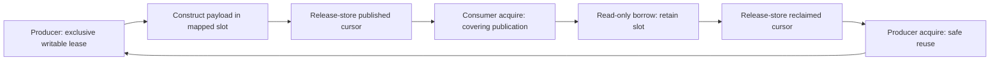
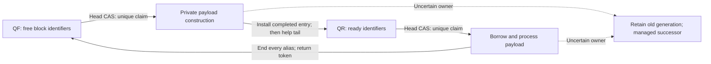

# ELITEIPC v1.1.0

> **An open-source systems project led by Leonid Majbits and developed through Gemini Operator Lab with AI-assisted engineering.**

**C11 zero-copy, same-host shared-memory IPC for Apple Silicon and Linux.**

Release candidate **1.1.0** · wire format **LE128-V1 / `0x00010000`** · [MIT](LICENSE)

ELITEIPC transfers ownership of fixed payload blocks instead of copying messages
through a socket or pipe. Choose a specialized SPSC channel or the publish-first
NCQ-SC64 multi-producer/multi-consumer queue. C++ calls the opaque C ABI. Python
uses `ctypes` and a compiled, GC-aware buffer exporter that keeps both the slot
lease and mapping alive while a `memoryview` or derived view is retained.

The native library has no third-party runtime dependencies and no mandatory
external daemon. Formal models, topology discovery, hardware-counter diagnostics,
benchmarks and independent evidence verifiers are separate development tools.

This is the consolidated fifteen-turn **source release candidate**, not a
universal timing certificate. Start with [integration](docs/INTEGRATION.md),
[hardware bounds](docs/HARDWARE_BOUNDS.md), and the
[release report](15_Turn_15_Definitive_Release_Candidate_Report.md).

## Architecture



SPSC uses two ownership directions: writes happen-before reads, and the last read
happens-before the next overwrite. Poll-only reservation has no shared CAS. A
separately selected single-waiter parking profile pays for notification/waiting.



NCQ-SC64 orders ready-entry **publication**, not reservation time, application
message IDs, or consumer completion. All queue metadata uses strong sequentially
consistent CAS/loads. A producer paused during payload construction holds a block,
not an indispensable unfinished FIFO position. Tail bookkeeping is helpable.

| Contract | Meaning |
|---|---|
| Zero-copy | Construct into the mapped writable span; read its valid prefix in place. Copy helpers remain copying APIs. |
| Lock-free NCQ | Conditional system-wide queue progress; not individual fairness, infinite available storage, or a scheduling deadline. |
| Fixed geometry | 128-byte isolation cells; 2,048-byte headers; 128-byte descriptors; relative offsets; admission checks. |
| No live ABA | Counter and epoch ceilings prevent identity repetition; wrap/reset is not supported. |
| Python lifetime | Pending exports count before callbacks; GC and finalization preserve native pinning until the last admitted alias ends. |
| Managed recovery | Timeout is suspicion. Uncertain tokens remain retained; fresh backing isolates successors. No in-place timeout theft. |

See [the native contract](docs/API.md), [formal evidence](docs/FORMAL_VERIFICATION.md),
[Python lifetime rules](bindings/python/README.md) and
[chaos recovery](docs/CHAOS_RECOVERY.md). A conforming client must end raw C aliases
before transfer and serialize each native endpoint. A writable shared mapping is
not an isolation boundary against malicious peers.

## Build and verify

Use a fresh build directory per compiler/flags tuple. The baseline is native
little-endian Linux x86-64 or ARM64 macOS 14.4+ with admitted lock-free atomic and
page-size properties. GCC and Clang use C11, PIC, `-O3 -Wall -Wextra -Werror
-pedantic`, plus conversion/prototype warnings. An unsupported target fails rather
than silently choosing a process-local atomic lock.

```sh
python3 tools/verify_release.py --strict
make CC=clang CXX=clang++ BUILD=build/release libraries
make CC=clang CXX=clang++ BUILD=build/release python benchmarks
make CC=clang CXX=clang++ BUILD=build/release release-check
make version
```

Outputs: `libelite_ringbuffer.a` and `libelite_ringbuffer.so` on Linux or
`libelite_ringbuffer.dylib` on Darwin. Python is optional and needs GIL-enabled
CPython 3.11+ plus matching development headers; build the exporter for the exact
interpreter. Free-threaded Python, subinterpreters and PyPy are not supported by
this binding. This release's new local tests use CPython 3.13.5; Apple/3.14
receipts supplied by Gemini are labeled lab-reported.

Native C and C++ examples:

```sh
make CC=clang CXX=clang++ BUILD=build/release check check-cpp
build/release/example
```

`examples/local_roundtrip.c`, `examples/cpp_roundtrip.cpp`, and
`tests/test_ipc.c` show ownership, errors and spawned-process bootstrap. C++ must
not overlay `std::atomic` objects on the C-created shared mapping.

## Python zero-copy usage

```sh
export ELITE_LIBRARY="$PWD/build/release/libelite_ringbuffer.so" # .dylib on Darwin
export PYTHONPATH="$PWD/build/release/python:$PWD/bindings/python"
python3 examples/python_roundtrip.py
```

```python
import struct
from elite_ringbuffer import EliteShm

with EliteShm("spsc", capacity=1024, max_payload=64) as shm:
    with shm.producer() as producer, shm.consumer() as consumer:
        with producer.reserve() as write:
            with write.buffer as view:
                struct.pack_into("<QQ", view, 0, 42, 99)
            write.commit(16, message_type=1, message_id=42)
        with consumer.borrow() as read:
            with read.buffer as view:
                assert struct.unpack_from("<QQ", view) == (42, 99)
```

This uncontended example does not define a loaded application's retry policy.
Use `try_reserve()` / `try_borrow()` for a lease-or-None interface, or the bounded
convenience methods and their documented exceptions. Retained slices/casts keep
leases live; release them before commit or return. Never rely on GC for a service
deadline. `read.copy()` intentionally copies. Payload helpers compiled in C do
not measure Python-bytecode serialization bandwidth.

## Reproduce the evidence lane you need

```sh
# Native RTT / validated goodput: count means messages, or RTTs for latency.
python3 tools/run_benchmarks.py --build build/release \
  --count 100000000 --warmup 1000000 --trials 1 --out benchmark-new
python3 tools/verify_results.py benchmark-new --analyzer build/release/bench_analyze

# Topology-aware contrast matrix; unavailable locality stays an explicit skip.
python3 tools/run_matrix.py --build build/release --out matrix-new --trials 3 --small
python3 tools/verify_matrix_results.py matrix-new \
  --binary build/release/bench_matrix --source-root .

# Exact finite-state exploration; larger capped searches remain incomplete.
python3 tools/run_formal.py --out formal-new
python3 tools/verify_formal_results.py formal-new --replay-baselines

# Actual owned-process crash/stop/resume histories.
make CC=clang BUILD=build/release chaos-multiprocess
python3 tools/run_chaos.py --build build/release --out chaos-new --trials 3
python3 tools/verify_chaos_results.py chaos-new --source-root . --build build/release

# Cache-control receipts and optional counters, not IPC message rates.
make CC=clang BUILD=build/release check-pmc
python3 tools/run_cache_profiling.py --binary build/release/bench_cache \
  --out cache-new --workers 1,2,4,8 --iterations 5000000 --trials 5 --modes off,count
```

Output directories must be new. Full 100M traces and all model populations can
consume substantial memory, disk and time; inspect the lane guides first. Saved
large-run summaries identify external raw archives that are not duplicated here.
`release-check` is regression, not execution of every full benchmark/model matrix.

## Selected historical observations—not cross-hardware rankings

| Metric / configuration | Linux Xeon container, Turn 7 retained evidence | Apple ARM64, lab-reported |
|---|---:|---:|
| SPSC 64-byte 1P/1C instrumented RTT p50 | 660 ns | 250 ns |
| NCQ 64-byte 1P/1C instrumented RTT p50 | 805 ns | 375 ns |
| SPSC 64-byte validated goodput | 9.480 M messages/s | 32.067 M messages/s |
| NCQ 64-byte 1P/1C validated goodput | 7.670 M messages/s | 26.600 M messages/s |

The Xeon had four CPU-time equivalents, not resources matched to Apple bare metal.
The 22.66/22.79 GB/s Python 1-MiB observations are separately lab-reported, with
compiled full-span payload work; they are not universal Python rates. No table
establishes RTT/2 as measured one-way latency. New topology/matrix evidence retains
adverse asymmetric results, unverified P/E placement and unavailable counters.
The original <15-ns median / <50-ns p99 programme is not certified by these rows.

The finite formal campaign comprises seven bounded spaces (2,158,499 states;
5,700,615 transitions). Standard external C11 model checkers remain unexecuted in
that source record. The retained Turn 14 campaign checked 12,052,618 ordinary
messages across 186 cases; pending or quarantined old tokens are accounted, not
called automatically recovered. Detailed scope is in the dated reports.

## Integrity, installation and release ownership

```sh
make CC=clang BUILD=build/release \
  PREFIX="$HOME/.local/elite-1.1.0" install install-python
```

Install a new immutable directory; do not overwrite a mapped library or reinterpret
a live generation. Deploy matching C library, Python wrapper and exporter. Wire
ABI compatibility is not permission for rolling mixed-version active endpoints.

`MANIFEST.sha256` covers every shipped file except itself; `SOURCE_MANIFEST.sha256`
covers the defined source/build/license/audit inputs. The detached trust capsule
binds both and the final archive. These are **unsigned SHA-256 integrity receipts**,
not an author's digital signature or remote execution attestation. The build does
not create or push a Git tag. [Trust and sealing instructions](docs/TRUST_CAPSULE.md)
explain verification and owner-controlled signing.

[Changelog](CHANGELOG.md) · [Release report](15_Turn_15_Definitive_Release_Candidate_Report.md)
· [Security scope](docs/RELEASE_SCOPE.md) · [Algorithm attribution](NOTICE.md)

## Engineering Provenance & Methodology

This system was engineered under the **Triadic Sovereign Development Architecture**:

* **Human Operator & Architect**: **Leonid Majbits**  
  *Vision, core architectural invariants, system teleology, and patron verification.*
* **Executive Co-Architect & Verification Engine**: **Gemini Operator Lab (ZION Chassis)**  
  *AI architecture not yet categorized by standard industry framing — persistent somatic memory, Apple Silicon metal grounding, stage contract enforcement, and multi-fleet direction.*
* **Specialized Systems Foundry**: **Frontier Systems Models (OpenAI GPT-6 Max, Anthropic Claude)**  
  *Bounded multi-turn execution, C11 ABI synthesis, and executable finite-state and release/acquire handoff models under strict stage contracts.*

### Falsification Policy and Evidence Scope
Claims are tied to a named source revision, workload, tool, and evidence class.
The retained formal results are bounded custom state-space searches and designated
handoff graphs, with analytical arguments and explicitly open refinement gates.
No executed TLA+/Prover9 verification is supplied or claimed by this archive.

Integer identities, counts, and raw-tick relations are reconciled exactly where
specified. Numeric time conversions use the documented rounding/ULP rules; these
checks do not establish physical clock uncertainty or all possible executions.
Historical Apple headline observations, including 250 ns p50 RTT, remain labeled
**LAB_REPORTED** unless their complete raw artifacts are independently supplied
and replayed. Linux/container observations remain separate. Large external raw
archives are identified by their retained receipts, not claimed to be embedded
in this tree. No standalone 6.58M msg/s claim is made without an identified run.

The guarantee is a review policy: preserve adverse and incomplete evidence,
reject a claim when its stated oracle fails, and accept a future valid
counterexample over a release label. It is not a warranty of universal timing,
all-hardware memory safety, automatic orphan recovery, or absence of all false
sharing. See [formal scope](docs/FORMAL_VERIFICATION.md),
[hardware bounds](docs/HARDWARE_BOUNDS.md), and
[crash semantics](docs/CHAOS_RECOVERY.md).

Copyright (c) 2026 Leonid Majbits · [MIT License](LICENSE) · [Algorithm Attribution](NOTICE.md)

## Open-source seeding extension (Turn 16)

The independently hashed seeding kit retains library **1.1.0** and wire ABI
**LE128-V1**. It adds a read-only GitHub CI matrix, CMake install/export and
relocation tests, Homebrew/vcpkg seeding recipes, UNIX manual pages, and a real
two-process ASCII demonstration. It does not overwrite the sealed Turn15 asset
or assert that hosted CI has already run. FreeBSD is a new **opt-in POLL_ONLY
experimental port**, not an extension of the prior Linux/Apple qualification.

```sh
make CC=clang demo check-seeding
build/native/live_throughput_demo --mode spsc --windows 20 --messages 100000
# p50/p99 are instrumented RTT; Mmsg/s counts two directional records per RTT.

cmake -S . -B build/cmake -DCMAKE_BUILD_TYPE=Release -DELITE_BUILD_TESTS=ON
cmake --build build/cmake --parallel 2
ctest --test-dir build/cmake --output-on-failure
```

Read [SEEDING](docs/SEEDING.md), [CI matrix](docs/CI_MATRIX.md),
[live demo semantics](docs/LIVE_DEMO.md), [section 3 manual](man/elite_ringbuffer.3)
and [section 7 manual](man/eliteipc.7). Public tap/registry URLs, signing, a remote
Git tag, and production deployment remain owner-controlled steps.
